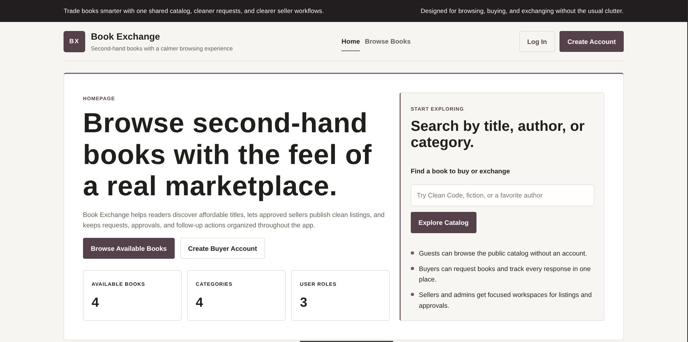
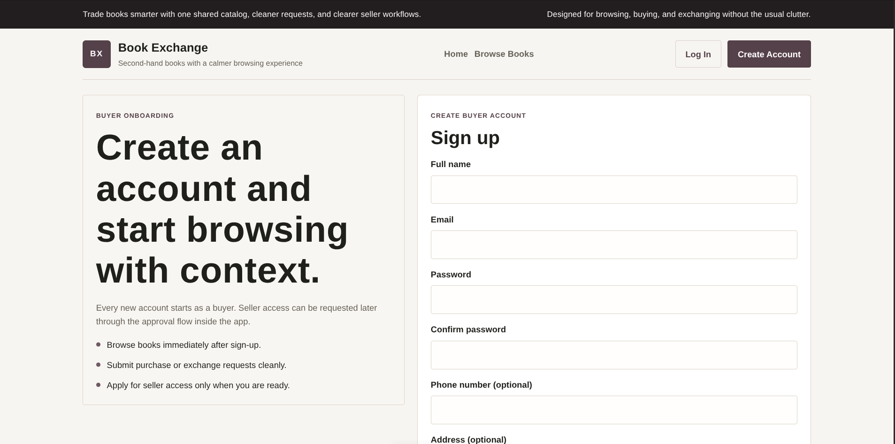
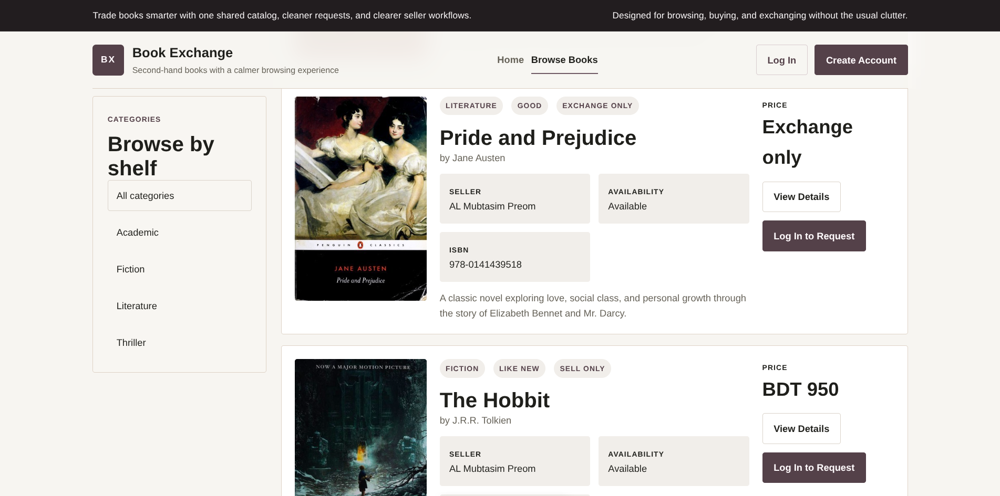
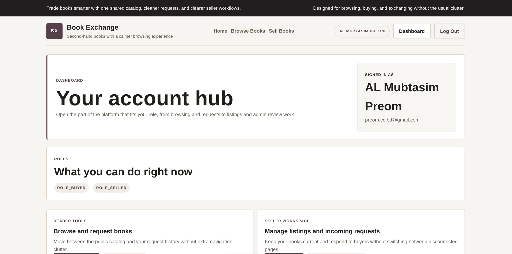
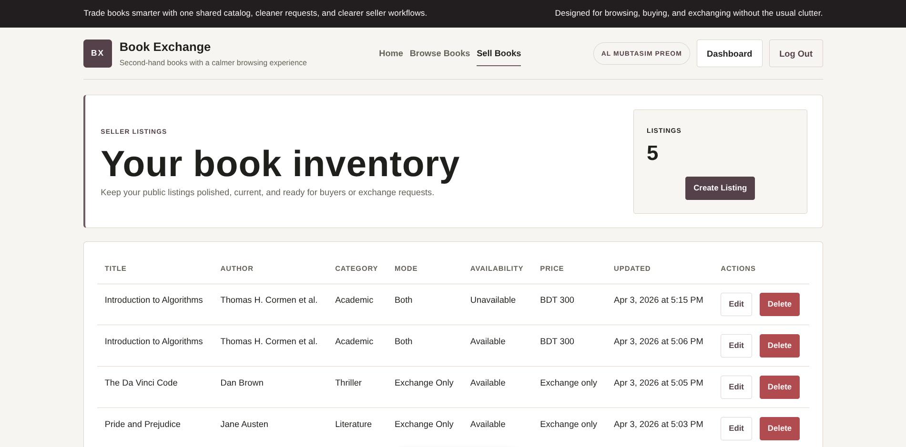
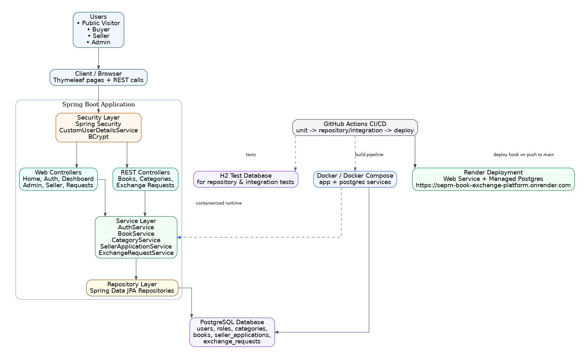
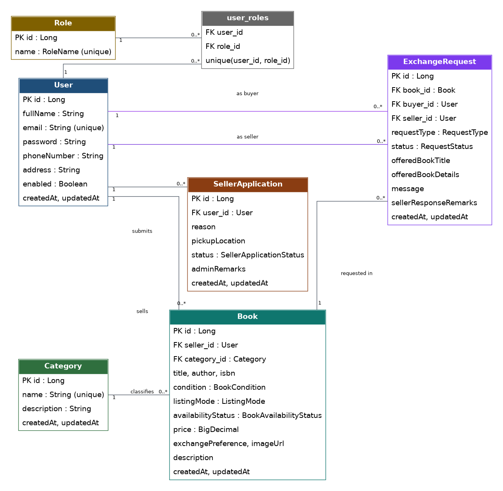
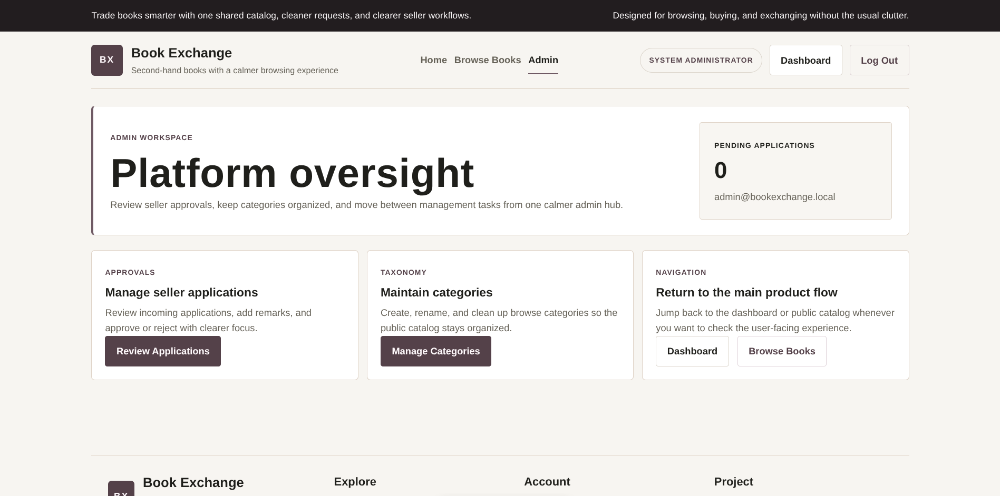

# Book Exchange Platform

Live URL: https://sepm-book-exchange-platform.onrender.com/

## Overview

Book Exchange Platform is a full-stack web application for browsing books, managing seller listings, and handling buy or exchange requests between users. The platform supports separate flows for guests, buyers, sellers, and admins.

## Screenshots

### Home Page



### Registration



### Browse Books



### Seller View



### Books by Seller



## Core Features

### Guest
- Browse available books
- View book details
- Search books by title or author
- Filter books by category
- Navigate paginated results
- Register and log in

### Buyer
- Create account and log in
- View personal dashboard
- Submit buy or exchange requests for available books
- View personal request history
- Apply to become a seller
- View seller application history

### Seller
- Create, edit, and delete book listings
- Set listing mode as `EXCHANGE_ONLY`, `SELL_ONLY`, or `BOTH`
- Mark listing availability
- View incoming requests
- Approve or reject requests

### Admin
- Review seller applications
- Approve or reject seller applications
- Manage categories

## Roles and Access Control

The platform uses Spring Security with role-based access control.

- `ROLE_BUYER` is assigned to newly registered users
- `ROLE_SELLER` is granted after seller approval
- `ROLE_ADMIN` is used for platform administration

Security includes:
- BCrypt password encoding
- Custom login/logout flow
- Protected admin and seller routes
- Protected REST API write endpoints

## Tech Stack

- Java 17
- Spring Boot
- Spring MVC
- Spring Data JPA
- Spring Security
- Thymeleaf
- PostgreSQL
- Maven
- Docker and Docker Compose
- GitHub Actions
- Render
- JUnit 5, Mockito, MockMvc, DataJpaTest, H2

## Project Structure

```text
src/main/java/com/team/book_exchange/
├── config/
├── controller/
│   ├── api/
│   └── web/
├── dto/
│   ├── api/
│   ├── auth/
│   ├── book/
│   ├── category/
│   ├── request/
│   └── seller/
├── entity/
├── enums/
├── exception/
├── repository/
├── security/
├── service/
│   └── impl/
└── BookExchangeApplication.java
```

## Main Modules

- Authentication and registration
- Seller application and approval flow
- Category management
- Seller book listing management
- Public book browsing, search, filtering, and pagination
- Buyer request submission and tracking
- Seller approval or rejection of requests
- REST API for books, categories, and requests
- CI/CD and cloud deployment

## Diagrams

### Architecture Diagram



### ER Diagram



Current main entities:
- `User`
- `Role`
- `SellerApplication`
- `Category`
- `Book`
- `ExchangeRequest`

Key relationships:
- `User` ↔ `Role` = many-to-many
- `User` → `SellerApplication` = one-to-many
- `User` → `Book` = one-to-many as seller
- `Category` → `Book` = one-to-many
- `Book` → `ExchangeRequest` = one-to-many
- `User` → `ExchangeRequest` = one-to-many as buyer and as seller

## Documentation

- [API Notes](docs/api_notes.md)
- [Deployment Notes](docs/deployment.md)
- [Final Report (PDF)](docs/report/Book_Exchange_Project_Report.pdf)

## Local Run

### Prerequisites
- Java 17
- Docker and Docker Compose

### Start PostgreSQL

```bash
docker compose up -d postgres
```

### Run the application

Debian / Git Bash:

```bash
./mvnw spring-boot:run
```

Windows CMD:

```cmd
mvnw.cmd spring-boot:run
```

Windows PowerShell:

```powershell
.\mvnw.cmd spring-boot:run
```

### Local URLs

- Home: `http://localhost:9090/`
- Browse books: `http://localhost:9090/books`
- Login: `http://localhost:9090/login`
- Register: `http://localhost:9090/register`
- Dashboard: `http://localhost:9090/dashboard`
- Admin area: `http://localhost:9090/admin`
- Seller books: `http://localhost:9090/seller/books`
- My requests: `http://localhost:9090/requests/my`
- Seller incoming requests: `http://localhost:9090/seller/requests`

## Testing

### Test Types
- Service unit tests
- Repository tests
- Controller integration tests

### Test Tools
- JUnit 5
- Mockito
- Spring Boot Test
- MockMvc
- DataJpaTest
- H2 test database

### Run tests

Unit tests:

```bash
./mvnw test
```

Repository and integration tests:

```bash
./mvnw -Dskip.unit.tests=true verify
```

Full verification:

```bash
./mvnw verify
```

## REST API

The project includes REST controllers for:
- Books
- Categories
- Exchange requests

For endpoint details, request/response examples, and access rules, see:
- [API Notes](docs/api_notes.md)

## CI/CD

GitHub Actions is configured to:
- run service and unit tests first
- run repository and integration tests after that
- trigger deployment from `main` after the test stages pass

### Branch Strategy
- `main` for release-ready code
- `develop` for active integration
- `feature/*` for feature branches


### Admin Area



## Future Improvements

- image upload instead of only image URL
- admin moderation of listings
- JWT authentication for API
- notifications
- better dashboard analytics
- more advanced search and sorting